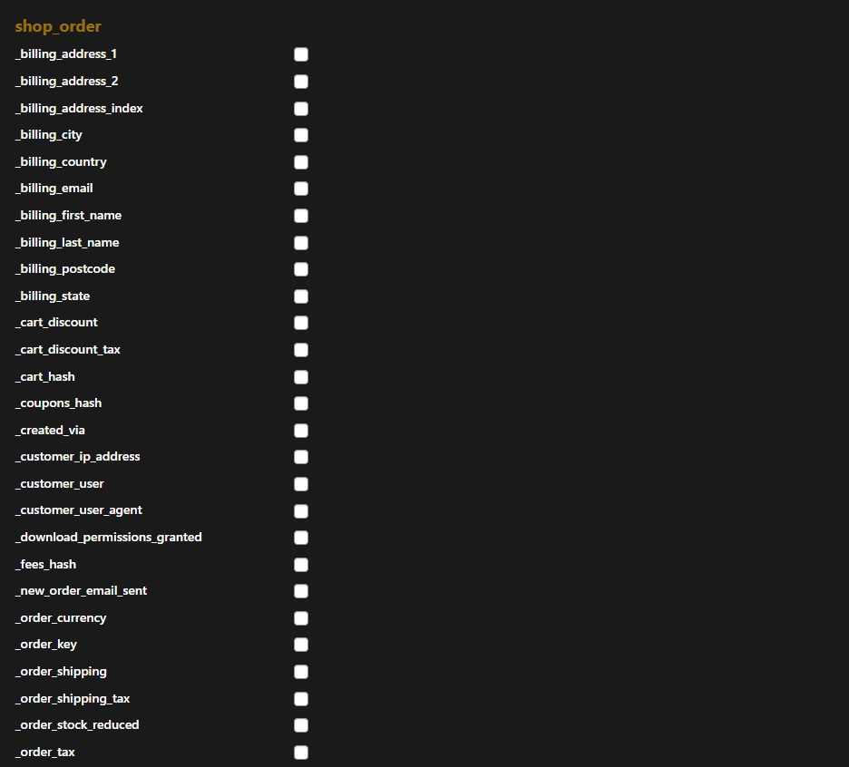

# 🚀 Zinn Digital™ WP REST API Manager

[](https://wordpress.org/)
[](https://php.net/)
[](https://www.gnu.org/licenses/gpl-2.0.html)
[](https://wordpress.org/)

> **Take complete control of your WordPress REST API exposure with a beautiful, intuitive interface.**

## 🎯 Overview

**Zinn WP REST API Manager** gives you total control over what your WordPress site exposes in the REST API—from post types to taxonomies to custom fields (meta). Toggle REST API exposure for all your data, including fields created by any third-party plugin (like ACF, Meta Box, Pods, and more), with a single click from a modern admin panel.

Built for agencies, developers, and site owners who want secure, modular, no-code REST API control.

---

## ✨ Features

🔧 **Complete Control**
- Instantly view all core & custom post types and taxonomies
- See which are exposed in the REST API at a glance
- Toggle REST API visibility for post types and taxonomies without code

🎛️ **Advanced Meta Management**
- Detect all custom fields (meta)—even from third-party plugins
- Enable/disable REST API exposure for custom fields per post type
- Works with ACF, Meta Box, Pods, and more

🎨 **Beautiful Interface**
- Modern dark admin interface with gold accent branding
- Sectioned UI: Core, Custom, and Meta fields organized for clarity
- Intuitive notices and guidance for best practices

🔒 **Security First**
- Nonces, permissions, sanitization, and escaping
- Capability checks for all admin actions
- Persistent settings that survive plugin updates

🌐 **Enterprise Ready**
- Multisite compatible
- Tested with major custom field plugins
- Professional support from Zinn Digital team

---

## 📸 Screenshots

### Core Post Types Management

*View and toggle REST API exposure for WordPress core post types*

### Custom Post Types Control  

*Manage REST API visibility for custom post types created by themes and plugins*

### Meta Fields & Support

*Enable REST API for custom meta fields and access built-in support*

---

## 🚀 Installation

### WordPress.org (Recommended)
1. Go to **Plugins → Add New** in your WordPress admin
2. Search for "Zinn WP REST API Manager" 
3. Click **Install Now** and then **Activate**

### Manual Installation
1. Download from [WordPress.org](https://wordpress.org/plugins/zinn-digital-wp-rest-api-manager/)
2. Upload the `zinn-wp-rest-api-manager` folder to `/wp-content/plugins/`
3. Activate the plugin through the **Plugins** menu in WordPress

### GitHub Installation
1. Clone this repository:
   ```bash
   git clone [https://github.com/zinndigital/zinn-wp-rest-api-manager.git](https://github.com/Zinn-Digital-LTD/Zinn-Digital-WP-REST-API-Manager.git)
   ```
2. Upload to your WordPress `/wp-content/plugins/` directory
3. Activate through WordPress admin

---

## 🔧 Usage

1. **Navigate** to **API Manager** in your WordPress admin menu
2. **Review** the sections:
   - **Core Post Types** - WordPress built-in post types
   - **Custom Post Types** - Theme/plugin created post types  
   - **Core/Custom Taxonomies** - Category, tag, and custom taxonomies
   - **Custom Fields (Meta)** - Meta fields from any source
3. **Toggle** REST API exposure with a single click
4. **Refresh** your REST API endpoints to see changes

### Custom Fields Detection
> **Note:** Custom fields will only appear if at least **one post** exists with those fields populated. Create and publish content first, then return to manage meta field exposure.

---

## 📋 Requirements

| Requirement | Version |
|-------------|---------|
| **WordPress** | 6.0+ |
| **PHP** | 7.4+ |
| **Tested up to** | WordPress 6.8, PHP 8.4 |

### Compatible Plugins
✅ Advanced Custom Fields (ACF)  
✅ Meta Box  
✅ Pods  
✅ Custom Fields Suite  
✅ Any plugin using WordPress standard post meta  

---

## 🔐 Security

This plugin follows WordPress security best practices:

- **Nonce verification** for all AJAX requests
- **Capability checks** (`manage_options`) for admin access
- **Input sanitization** using `sanitize_text_field()`
- **Output escaping** with `esc_html()`, `esc_url()`, `esc_attr()`
- **Prepared SQL statements** for database queries
- **Proper ABSPATH checks** in all files

---

## 🛠️ Development

### Local Development Setup
```bash
# Clone the repository
git clone https://github.com/Zinn-Digital-LTD/Zinn-Digital-WP-REST-API-Manager.git

# Navigate to WordPress plugins directory
cd /path/to/wordpress/wp-content/plugins/

# Create symlink with correct plugin folder name
ln -s /path/to/Zinn-Digital-WP-REST-API-Manager zinn-digital-wp-rest-api-manager
```

### File Structure
```
zinn-wp-rest-api-manager/
├── zinn-wp-rest-api-manager.php    # Main plugin file
├── uninstall.php                   # Cleanup script
├── readme.txt                      # WordPress.org readme
├── screenshot-*.png                # Plugin screenshots
├── assets/                         # CSS, JS, images
│   ├── zinn-wpapi-admin.css       # Admin styling
│   ├── zinn-wpapi-admin.js        # Admin JavaScript
│   └── zinn-logo.png              # Branding
└── inc/                           # PHP classes
    └── class-zinn-wpapi-admin.php # Admin functionality
```

---

## 🤝 Contributing

We welcome contributions! Please feel free to submit a Pull Request. For major changes, please open an issue first to discuss what you would like to change.

### Guidelines
1. Follow WordPress coding standards
2. Add appropriate documentation
3. Test thoroughly before submitting
4. Include screenshots for UI changes

---

## 📞 Support

Need help? We're here for you!

- 📧 **Email**: [office@zinndigital.com](mailto:office@zinndigital.com)
- 🌐 **Website**: [zinndigital.com](https://zinndigital.com/)
- 🛒 **Marketplace**: [zinnhub.com](https://zinnhub.com/)
- 📖 **Documentation**: [WordPress.org Plugin Page](https://wordpress.org/plugins/zinn-digital-wp-rest-api-manager/)

When contacting support, please include:
- Detailed description of the issue
- Screenshots (if applicable)
- WordPress version
- PHP version
- Active plugins list

---

## 📄 License

This project is licensed under the **GPL v2 or later** - see the [LICENSE](https://www.gnu.org/licenses/gpl-2.0.html) for details.

---

## 🏢 About Zinn Digital

**Zinn Digital™ LTD** is a professional digital services company, proving multiple digital solutions that solve real world problems and save you time.

### Our Services
- 🌐 **Web Hosting** - Fast, reliable WordPress hosting & web hosting solutions
- 🛒 **Digital Marketplace** - Premium frellance services, digital jobs and more
- 🎯 **Wordpress Plugins** - Professional WordPress plugins

---

<div align="center">

**Made with ❤️ by [Zinn Digital™](https://zinndigital.com/)**

[⚡ Zinn WebHosting](https://zinndigital.com/) • [💼 Zinn Hub Marketplace](https://zinnhub.com/)

</div>
