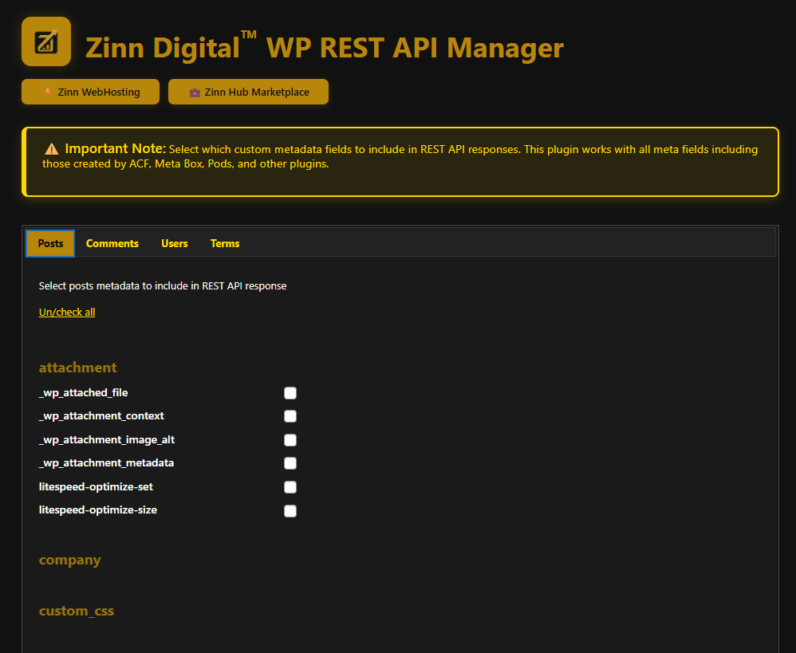

# 🚀 Zinn Digital™ WP REST API Manager

[](https://wordpress.org/)
[](https://php.net/)
[](https://www.gnu.org/licenses/gpl-2.0.html)
[](https://wordpress.org/)

> **Manage and control REST API exposure for WordPress metadata fields with complete flexibility.**

## 🎯 Overview

**Zinn Digital™ WP REST API Manager** gives you complete control over which custom metadata fields are exposed in your WordPress REST API responses. Perfect for headless WordPress, mobile apps, and third-party integrations.

Works seamlessly with all major custom field plugins including ACF, Meta Box, Pods, Toolset, and any plugin that uses WordPress meta tables.

Built for developers, agencies, and site owners who need precise control over their REST API data exposure.

---

## ✨ Features

### 🎛️ **Complete Meta Control**
- Expose custom fields from posts, pages, and custom post types
- Include comment, user, and taxonomy term metadata
- Universal meta detection for fields used across multiple post types
- Granular control - select exactly which fields to expose

### 🔌 **Plugin Compatibility**
- ✅ Advanced Custom Fields (ACF)
- ✅ Meta Box
- ✅ Pods
- ✅ Custom Field Suite
- ✅ Toolset Types
- ✅ Carbon Fields
- ✅ CMB2
- ✅ Any plugin using WordPress meta tables

### 🎨 **Beautiful Admin Interface**
- Modern dark theme with gold accent branding
- Organized tabbed interface for different meta types
- Bulk operations - check/uncheck all with one click
- Intuitive field detection and display

### 🔒 **Enterprise Ready**
- WordPress security best practices
- Proper capability checks and nonce verification
- Multisite compatible
- Performance optimized
- Clean, documented code

### 🌐 **Developer Friendly**
- Namespaced code (ZinnZWRAM)
- Follows WordPress coding standards
- Hooks and filters for extensibility
- Comprehensive uninstall cleanup

---

## 📸 Screenshots

### Posts Meta Fields Management

*Select which post meta fields to expose in the REST API*

### Tabbed Interface

*Clean, organized interface for managing all meta types*

### Universal Meta Section

*Special section for meta keys used across multiple post types*

---

## 🚀 Installation

### WordPress Admin (Recommended)
1. Navigate to **Plugins → Add New**
2. Search for "Zinn Digital WP REST API Manager"
3. Click **Install Now** then **Activate**
4. Go to **Settings → WP REST API Manager**

### Manual Installation
```bash
# Download the plugin
wget https://github.com/zinndigital/zinn-digital-wp-rest-api-manager/archive/main.zip

# Unzip to plugins directory
unzip main.zip -d /path/to/wordpress/wp-content/plugins/

# Rename folder
mv zinn-digital-wp-rest-api-manager-main zinn-digital-wp-rest-api-manager
```

### Composer
```json
{
    "require": {
        "zinndigital/wp-rest-api-manager": "^1.0"
    }
}
```

---

## 🔧 Usage

### Basic Usage

1. **Navigate** to **Settings → WP REST API Manager**
2. **Select** the tab for the meta type you want to configure:
   - **Posts** - All post types including pages and custom post types
   - **Comments** - Comment metadata
   - **Users** - User metadata  
   - **Terms** - Taxonomy term metadata
3. **Check** the fields you want to expose
4. **Save** your settings

### Accessing Fields via REST API

Once fields are enabled, they appear in standard REST API responses:

```javascript
// Fetch post with custom fields
fetch('https://yoursite.com/wp-json/wp/v2/posts/123')
  .then(response => response.json())
  .then(post => {
    console.log(post.custom_field_name); // Your exposed field
  });
```

### Example Response
```json
{
  "id": 123,
  "title": "Sample Post",
  "content": "...",
  "custom_price": "29.99",
  "custom_color": "blue",
  "acf_field": "value"
}
```

---

## 🔌 Developer API

### Hooks

Filter which post types show meta fields:
```php
add_filter('zinn_zwram_post_types', function($post_types) {
    // Remove attachment post type
    unset($post_types['attachment']);
    return $post_types;
});
```

Modify detected meta keys:
```php
add_filter('zinn_zwram_meta_keys', function($keys, $post_type) {
    // Add custom key
    $keys[] = 'my_custom_key';
    return $keys;
}, 10, 2);
```

### Programmatic Field Registration

```php
// Register a field programmatically
add_action('init', function() {
    $options = get_option('zinn_zwram_options_post', []);
    $options['zinn_zwram_field_my_field'] = 1;
    update_option('zinn_zwram_options_post', $options);
});
```

---

## 📋 Requirements

| Component | Minimum | Recommended |
|-----------|---------|-------------|
| **PHP** | 7.4 | 8.0+ |
| **WordPress** | 6.0 | 6.8 (latest) |
| **MySQL** | 5.7 | 8.0+ |
| **MariaDB** | 10.3 | 10.6+ |

---

## 🔒 Security

This plugin implements multiple security measures:

- ✅ **Capability Checks** - `manage_options` required for all admin actions
- ✅ **Nonce Verification** - All forms use WordPress nonces
- ✅ **Data Sanitization** - All input properly sanitized
- ✅ **SQL Injection Prevention** - Prepared statements for all queries
- ✅ **XSS Protection** - Proper output escaping throughout

---

## 🤝 Contributing

We welcome contributions! Please see our [Contributing Guidelines](CONTRIBUTING.md) for details.

### Development Setup

```bash
# Clone the repository
git clone https://github.com/zinndigital/zinn-digital-wp-rest-api-manager.git

# Install dependencies
composer install
npm install

# Run tests
composer test
npm test
```

### Coding Standards

This plugin follows WordPress Coding Standards:

```bash
# Check standards
composer run-script phpcs

# Fix automatically
composer run-script phpcbf
```

---

## 📞 Support

Need help? We're here for you!

- 📧 **Email**: [office@zinndigital.com](mailto:office@zinndigital.com)
- 🌐 **Website**: [zinndigital.com](https://zinndigital.com/)
- 🛒 **Marketplace**: [zinnhub.com](https://zinnhub.com/)
- 📖 **Documentation**: [View on WordPress.org](https://wordpress.org/plugins/zinn-digital-wp-rest-api-manager/)

### Reporting Issues

When reporting issues, please include:
- WordPress version
- PHP version
- Error messages (if any)
- Steps to reproduce
- Screenshots

---

## 📄 License

This project is licensed under the **GPL v2 or later** - see the [LICENSE](LICENSE) file for details.

```
This program is free software; you can redistribute it and/or modify
it under the terms of the GNU General Public License as published by
the Free Software Foundation; either version 2 of the License, or
(at your option) any later version.
```

---

## 🏢 About Zinn Digital

**Zinn Digital™ LTD** is a professional digital services company specializing in WordPress solutions, web hosting, and digital marketplace services.

### Our Services
- 🌐 **Web Hosting** - Enterprise WordPress hosting solutions
- 💻 **WordPress Development** - Custom plugins and themes
- 🛒 **Digital Marketplace** - [ZinnHub.com](https://zinnhub.com/)
- 🚀 **Professional Services** - Consulting and development

---

## 🙏 Acknowledgments

- WordPress Core Team for the REST API infrastructure
- The open source community for continuous inspiration
- Our users for valuable feedback and support

---

<div align="center">

**Made with ❤️ by [Zinn Digital™](https://zinndigital.com/)**

[⚡ Zinn WebHosting](https://zinndigital.com/) • [💼 Zinn Hub Marketplace](https://zinnhub.com/) • [📧 Contact Us](mailto:office@zinndigital.com)

</div>
